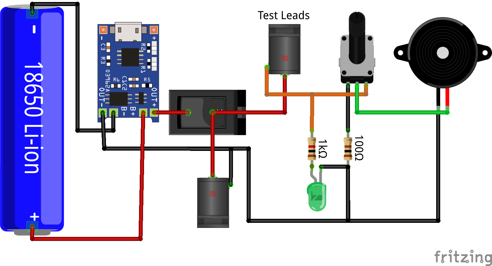

# Cable Continuity Tester

A compact, rechargeable cable continuity tester, with adjustable volume and removable test leads.

## Features

1. Cable continuity testing with LED and sound indication
2. Adjustable volume control
3. Silent mode
4. Removable test leads
5. Main Power On/Off switch
6. USB Type-C Charging with overcharge, over-discharge and short-circuit protection
7. Charging and Full-Charge LED Indication
8. Power output

---

## Components

1. 1× 18650 Li-Ion Battery
2. 1× HW-373 USB Type-C Li-Ion Charger Module
3. 1× Active Buzzer
4. 1× 1 kΩ Linear Potentiometer
5. 1× On/Off Switch
6. 1× Green LED
7. 1× 1 kΩ Resistor
8. 1× 100 Ω Resistor
9. 2× 5.5×2.1mm DC Power Jack Sockets
10. 1× 5.5×2.1mm DC Power Jack Plug
11. 2× 50 mm Alligator Clips
12. 1× Enclosure Case
13. DC Power Cable
14. Hookup Wire

----

## Circuit

